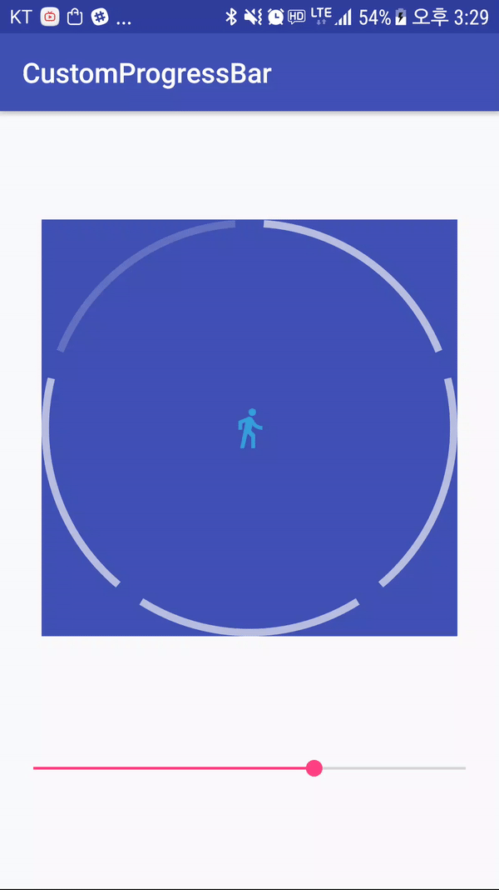
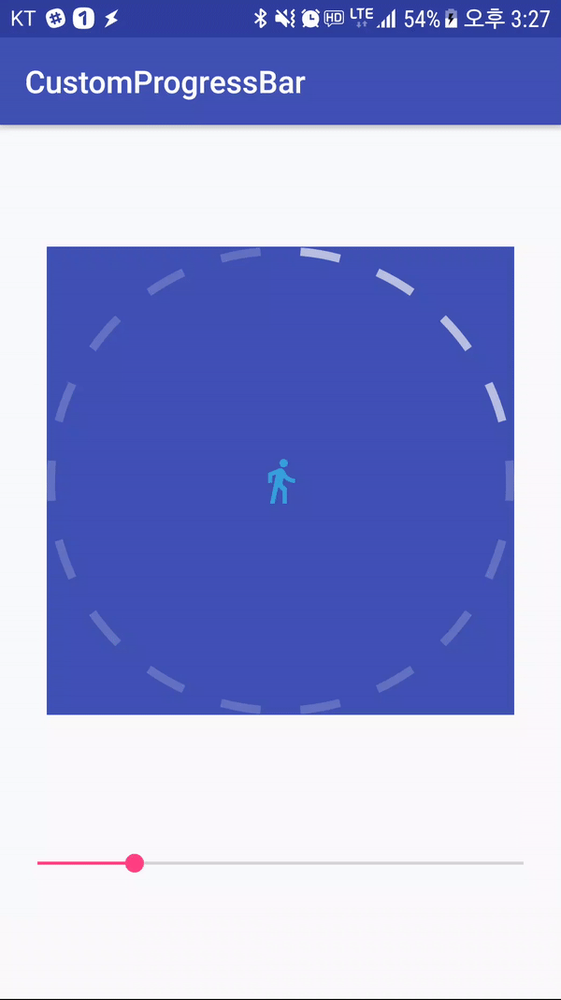

#  CircularProgressBar with Partition

### you can customize both the interval and bar

#### *** Properies

* 'app:progress'                                     (interger), default  0
* 'app:progressbar_color'                      (color),  default Color.BLACK
* 'app:progressbar_unselectedcolor'     (color), default Color.WHITE
* 'app:progressbar_width'                      (dimension), default 7dp
* 'app:progressbar_bgimg'                    (reference|interger)
* 'app:progressbar_interval'                   (float), default 8f
* 'app:progressbar_partial'                   (float), default 64f

### default usage

~~~xml
<com.example.lf_wannabe.customprogressbar.CircularProgressBar
       xmlns:cp="http://schemas.android.com/apk/res/com.example.lf_wannabe.customprogressbar"
        android:id="@+id/cp"
        android:layout_width="300dp"
        android:layout_height="300dp"
        cp:progress="65"
        cp:progressbar_color="#aaf5f5f5"
        cp:progressbar_width="16px"
        cp:progressbar_bgimg="@drawable/ic_action_bgimg"
        cp:progressbar_unselectedcolor="#33f5f5f5"/>
~~~

### preview

### usage

~~~xml
<com.example.lf_wannabe.customprogressbar.CircularProgressBar        						xmlns:cp="http://schemas.android.com/apk/res/com.example.lf_wannabe.customprogressbar"
        android:id="@+id/cp"
        android:layout_width="300dp"
        android:layout_height="300dp"
        android:background="@color/colorPrimary"
        cp:progress="65"
        cp:progressbar_interval="10"
        cp:progressbar_partial="10"
        cp:progressbar_color="#aaf5f5f5"
        cp:progressbar_width="16px"
        cp:progressbar_bgimg="@drawable/ic_action_bgimg"
        cp:progressbar_unselectedcolor="#33f5f5f5"/>
~~~

### preview

